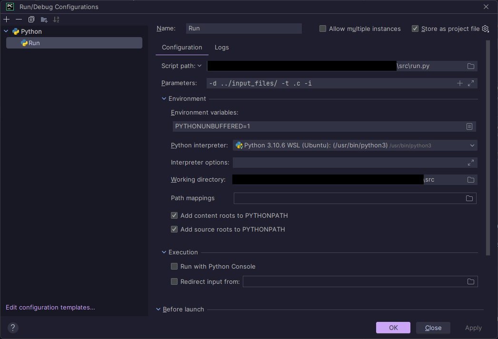

# Compiler


In this project, we will create a compiler from scratch.  
This compiler is capable of compiling **C language code**.  
It will be made in Python.

This project is made for the course Compilers at the **University of Antwerp**.

## Table Of contents

1. [Assignments.](#assignments)
2. [Testing.](#testing)
3. [Files.](#files)
4. [Sources.](#sources)
5. [Authors.](#authors)

## Assignments

- [X] Project 1
- [X] Project 2
- [X] Project 3
- [X] Project 4
  - [X] For loops
  - [X] While loops
  - [X] Break
  - [X] Continue
- [X] Project 5
  - [X] Function declarations
  - [X] Function definitions
  - [X] Function calls
  - [X] Return
  - [X] Return values and type checking / **void type**
  - [X] No dead code after **return, break, continue**
- [X] Project 6
  - [X] Arrays
    - [X] Declarations
    - [X] Access
  - [X] Printf
  - [X] Scanf
  - [X] Includes
- [ ] LLVM
  - [X] Project 1
  - [X] Project 2
  - [X] Project 3
  - [ ] Project 4
  - [ ] Project 5
  - [X] Project 6 - **Half implemented**
- [ ] MIPS

  - [X] Project 1
  - [X] Project 2
  - [ ] Project 3
  - [X] Project 4
  - [X] Project 5
  - [X] Project 6

## Testing

Guide on how to test our Compiler, the guide is meant for Pycharm users.

Check if the following path is set right. You could do this by running it on Pycharm, or Terminal, or by script.
If you do it in the terminal, match the **"parameters"** option of pycharm with the parameters in the Terminal.

### Jetbrains Pycharm



### Terminal

There are two ways to run it via terminal
Common parameter settings:

| Short command | Long command    | Type     | Required                  | Description                                                                      |
| ------------- | --------------- | -------- | ------------------------- | -------------------------------------------------------------------------------- |
| -d            | --directory     | `<path>` | **Yes**                   | Directory of the input files                                                     |
| -t            | --type          | `<str>`  | **Yes**                   | File extension                                                                   |
| -f            | --files         | `[str]`  | Exclusive. Takes priority | Files to parse                                                                   |
| -a            | --all           | `NaN`    | Exclusive. Least priority | Parse all the files in the directory                                             |
| -i            | --index         | `<int>`  | Exclusive                 | Parse the i-th file in the directory                                             |
| -v            | --verbose       | `NaN`    | No                        | Print the AST                                                                    |
| -nw           | --no-warning    | `NaN`    | No                        | Do not print warnings                                                            |
| -e            | --execute-with  | `[str]`  | No                        | Execute the mips code generated for the program. Can be "spim", "mars" or "both" |
| -s            | --silent        | `NaN`    | No                        | Do not print the output of the program                                           |
| -nd           | --no-disclaimer | `NaN`    | No                        | Remove the disclaimers for "spim" and "mars" from the output                     |
| -vs           | --visualise     | `NaN`    | No                        | Generate a dot format file and compile it to a png                               |
| -h            | --help          | `NaN`    | `NaN`                     | For help                                                                         |

Example code with specified input files:

```shell
python -d ../input_files/ -t .c -f Project3 Project2 ...
```

Example code with only the input directory and file extension

```shell
python -d ../input_files/ -t .c -a
```

Example code with only the input directory and an index

```shell
python -d ../input_files/ -t .c -i 3
```

<!-- #### Script

> **Warning** The LLVM class function _**execute&#40;&#41;**_ does not work on windows. Disable it when testing on windows.

> How to disable?
> > comment on line 36 on run.py -->

#### Available tests

##### All correct programs

```shell
cd src || exit &
python3 run.py -d ../input_files/CorrectCode/fully_working/ -t .c -a -e mars -nd
```

##### All programs with errors

```shell
cd src || exit &
python3 run.py -d ../input_files/SemanticErrors/fully_working/ -t .c -a -e mars -nd
```

##### Recursive fibonacci

```shell
cd src || exit &
python3 run.py -d ../input_files/CorrectCode/fully_working/ -t .c -f fibonacciRecursive -e mars
```

##### Scanf tests

```shell
cd src || exit &
python3 run.py -d ../input_files/CorrectCode/fully_working/ -t .c -f Scanf1 Scanf2 -e mars
```

##### Printf tests

```shell
cd src || exit &
python3 run.py -d ../input_files/CorrectCode/fully_working/ -t .c -f Printf1 Printf2 Printf3 -e mars
```

#### Compiling the grammar

1. Go to Grammar folder using ```cd``` command
2. Execute the following command:

```shell
antlr4 -o ../src/output -listener -visitor -Dlanguage=Python3 Math.g4  
```

### Files

- [Grammar: Math.g4](./Grammars/Math.g4)
- [Python scripts](./src/)
- [C Files](./input_files/)
- [ASM output files](./MIPS_output/)
- [Graphics output files](./Output/graphics)

### Sources

[Antlr4 installation](https://github.com/antlr/antlr4/blob/master/doc/getting-started.md)

[Dot language reference](https://graphviz.org/doc/info/lang.html)

[LLVM](https://llvm.org/)

[LLVM ref. page](https://llvm.org/docs/LangRef.html)

[Mips syscall info](https://courses.missouristate.edu/kenvollmar/mars/help/syscallhelp.html)

[while loops mips](https://people.cs.pitt.edu/~childers/CS0447/lectures/mips-isa4.pdf)

[Unaligned address in store error, using the wrong load](https://stackoverflow.com/questions/29832201/unaligned-address-in-store-error-when-saving-a-word)

### Authors

| **Name**   | **Email**                             | **Student number** |
| ---------- | ------------------------------------- | ------------------ |
| _Jason L._ | <Jason.Liu@student.uantwerpen.be>     | 20213082           |
| _Orfeo T._ | <Orfeo.Terkuci@student.uantwerpen.be> | 20213863           |
